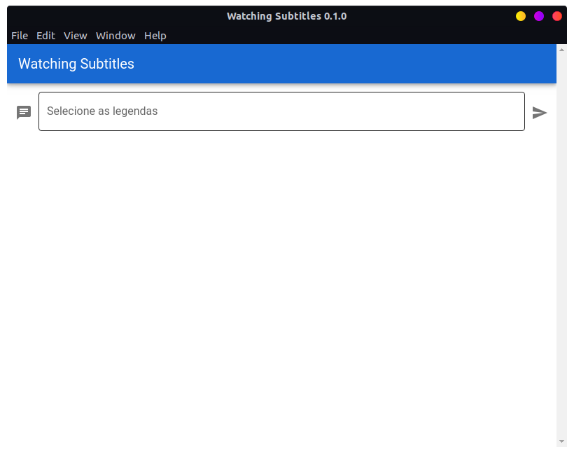
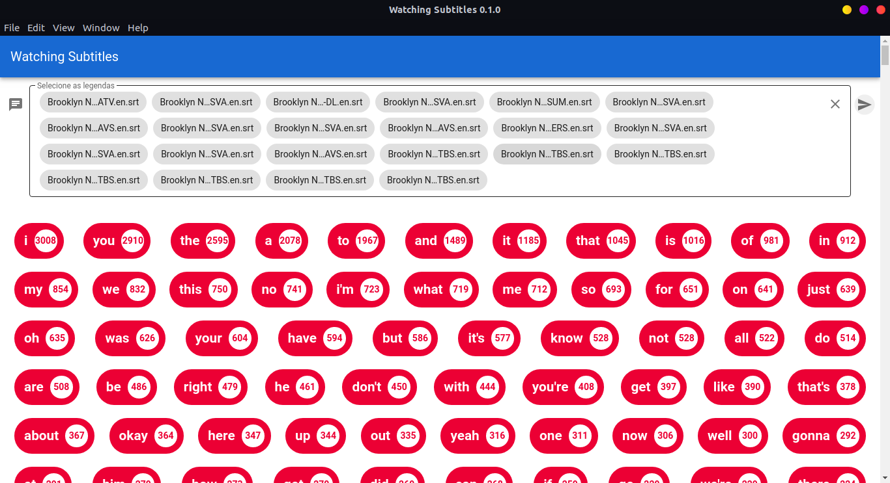

<div align="center">



</div>

<br>
<p align="center">
    Application made with the objective of discovering the most spoken lines in his films, TV series.🚀
</p>
<p align="center"> Done at Electron and Vue.Js </p>

## Exemplo:



## Getting Started 🚀

#### Requirements

-   [Node.js](https://nodejs.org/en/)
-   [Yarn](https://yarnpkg.com/) or [npm](https://www.npmjs.com/)
-   [Electron](https://www.electronjs.org/)

#### Cloning

```ps
# Clone the repository using git
$ git clone https://github.com/JuanPabllo/WatchingSubtitles.git

# Access the project folder
$ cd most-used-words
$ yarn install or npm i
```

#### Running

To start the aplication run the command

```ps
# Entering in web directory
$ yarn run electron:serve
 or
$ npm run electron:serve
```

### Issues 🐛

#### Report

In case you are having any problem do not be shy to report to us in [Issues](https://github.com/JuanPabllo/WatchingSubtitles/issues) session.

### Contributing 🤝

There are many forms to contribute with the project, first of all you can give this github repo a Star.

If you want do help with the code follow the steps bellow

```ps
# Fork using GitHub official command line
# If you don't have the GitHub CLI, use the web site to do that.
$ gh repo fork JuanPabllo/WatchingSubtitles

# Clone your fork
$ git clone {your-fork-url}
$ cd WatchingSubtitles

# Create a branch with your feature
$ git checkout -b {branch-name}

# Make the commit with your changes
$ git commit -m 'Feat: {feature-name}'

# Send the code to your remote branch
$ git push origin {branch-name}
```

> Then send a Pull Request that will be analyzed and approved if it helps with the project

This project is under the MIT license. See the [LICENSE](https://github.com/JuanPabllo/WatchingSubtitles/blob/master/LICENSE) for more information.
